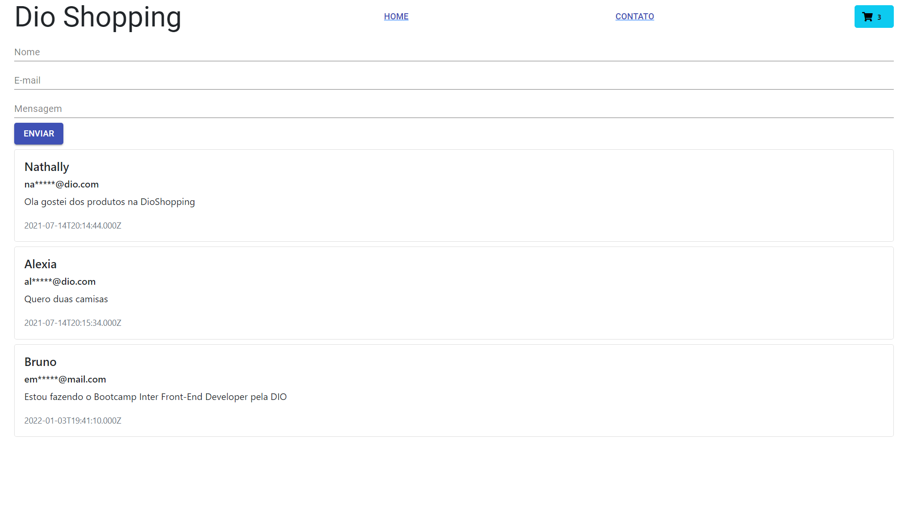

Integrando Back-end em Node.js com Front-end em React na página de contato de um e-commerce

1. Clone o repositório de back-end https://github.com/ALTbruno/api-dioshopping
2. npm i
3. npm run dev

4. Clone o repositório de front-end https://github.com/ALTbruno/dioshopping
5. npm i
6. npm start

